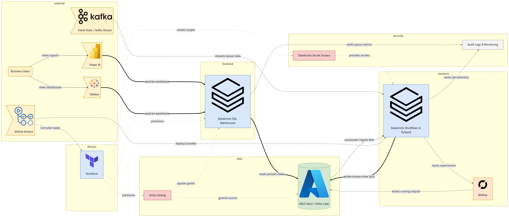

# plot-agent

> **BRD → Mermaid architecture diagram.** Hand a Business Requirements Document to a team of LangGraph agents and get back a readable Mermaid flowchart, a Self-Q&A solution summary, and a rendered PNG.

[](./LICENSE)
[](https://www.python.org/)
[](https://github.com/langchain-ai/langgraph)



> *Above: `samples/Databricks_Project_BRD.pdf` fed in, ~11 minutes later this diagram is produced end-to-end (13 nodes, 20 semantic edges, official brand logos). The run's `plan_reviewer` verdict `ok=True score=0.84` also surfaced 7 missing concerns (DR, SLOs, cost, observability, data residency, identity federation, semantic-layer ownership) in `summary.md`.*

---

## Why another "AI diagrammer"

Most LLM diagramming projects ask a single model to plan and emit the final artifact in one shot, which compounds errors. **plot-agent** takes a different cut:

1. **Split responsibilities across agents.** A planner proposes a tech plan; a plan-reviewer gates it at the architectural level; five executor roles (`frontend / backend / data / devops / security`) iterate in a subgraph, each seeing its peers' decisions; a design-reviewer gates again at the component level; a `mermaid_maker` emits a structured IR; a `mermaid_renderer` writes `.mmd`, `summary.md`, and a PNG.
2. **Harness engineering, not vibes.** Every agent's input/output is locked by a Pydantic schema. LLM failures go through a repair loop and otherwise raise `LLMCallError`. **No hard-coded business fallbacks anywhere in the package** — the open-source repo is free of opinionated defaults pretending to be agent output.
3. **Decouple via a Mermaid IR.** The LLM only emits IR. Text generation and PNG rendering live in plain Python; you can swap in Graphviz / Excalidraw / draw.io backends.
4. **Observable.** State carries an append-only `trace` and one `AIMessage` per agent. Use `app.stream(..., stream_mode="updates")` to watch every agent's reply live.

---

## Pipeline topology

```
START → planner ↔ plan_reviewer → executors subgraph → reviewer → mermaid_maker → renderer → END
            ▲           │                                  │
            └── revise ─┘                                  └── bounce back to executors
```

Two review stages, two rubrics:

- **`plan_reviewer`** (high level, before elaboration): does the overall stack fit the BRD?
  Is anything obviously missing (DR, compliance, cost)? Are the open questions the right ones?
  One extra LLM call saves ~10 executor calls when the plan needs reshaping.
- **`reviewer`** (low level, after elaboration): are the component designs internally
  consistent? Do `depends_on` relationships close? Does security align with backend interfaces?

| Agent | Job | Output |
| --- | --- | --- |
| `planner` | BRD → Self-Q&A chain → TechPlan; revises when `plan_reviewer` pushes back. | `TechPlan` |
| `plan_reviewer` | High-level architecture critique before elaboration. | `PlanReviewReport` |
| `executors/{role}` × 5 | Refine just one role using the plan + peer designs + review feedback. | `ComponentDesign` |
| `reviewer` | Low-level design consistency review; nominate a `target_role`. | `ReviewReport` |
| `mermaid_maker` | Designs → colour-coded nodes, semantic edges, subgraph groups, optional logos. | `MermaidIR` |
| `mermaid_renderer` | IR → `.mmd` + `summary.md` (+ optional PNG via Kroki / mmdc). | files |

Deep dive on state, schemas, harness details, and design trade-offs: [`docs/ARCHITECTURE.md`](./docs/ARCHITECTURE.md).

---

## Quickstart

```bash
git clone https://github.com/LovHan/archimaid-multi-agent-architecture-diagrams.git
cd plot_agent

poetry install                  # registers the `plot-agent` console script
cp .env.example .env            # then fill in OPENAI_API_KEY
```

Optional extras:

```bash
poetry install -E pdf                     # feed .pdf BRDs directly (adds pypdf)
npm i -g @mermaid-js/mermaid-cli          # offline PNG rendering (otherwise Kroki HTTP is used)
```

### CLI

```bash
plot-agent --help

# Full pipeline: BRD → planner → plan_reviewer → executors → reviewer → mermaid → PNG
plot-agent generate samples/databricks_brd.txt

# .pdf input (requires the `pdf` extra); skip PNG, write only .mmd + summary.md
plot-agent generate samples/Databricks_Project_BRD.pdf --no-png

# Re-render PNG from an existing .mmd (no LLM tokens, runs in seconds)
plot-agent render out/diagram.mmd
plot-agent render out/diagram.mmd --backend mmdc --out diagram.png
```

Default output goes to `out/`:

```
out/
├── diagram.mmd        # mermaid source
├── diagram.png        # rendered (default: Kroki HTTP; mmdc available too)
└── summary.md         # plan + designs + review + embedded mermaid
```

### Python API

```python
from plot_agent import build_brd_to_mermaid_pipeline
from plot_agent.memory import make_checkpointer, make_store

app = build_brd_to_mermaid_pipeline(
    checkpointer=make_checkpointer(),
    store=make_store(),
)

result = app.invoke(
    {
        "brd": open("samples/databricks_brd.txt").read(),
        "out_dir": "out",
        "render_png": True,
    },
    {"configurable": {"thread_id": "demo"}, "recursion_limit": 50},
)
print(result["mermaid_code"])
```

---

## Configuration

Variables read from `.env` (see `.env.example`):

| Variable | Default | Purpose |
| --- | --- | --- |
| `OPENAI_API_KEY` | — | required |
| `OPENAI_BASE_URL` | `https://api.openai.com/v1` | any OpenAI-compatible endpoint (Azure OpenAI / vLLM / Ollama-shim) |
| `PLANNER_MODEL` | — | used by planner / executors / mermaid_maker |
| `CRITIC_MODEL` | falls back to `PLANNER_MODEL` | used by both reviewer agents |
| `KROKI_URL` | `https://kroki.io` | point to a self-hosted Kroki if needed |

---

## Tests

```bash
poetry run pytest -q
```

CI needs no API key: `tests/conftest.py` monkeypatches `_invoke_llm` to return stub JSON keyed by the agent's system prompt. The stub data lives **only in tests** and never leaks into the `plot_agent/` package.

---

## Roadmap & Contributing

Roadmap items and how to pick one up: [`docs/ROADMAP.md`](./docs/ROADMAP.md).

PRs and issues welcome.

## License

[MIT](./LICENSE)
